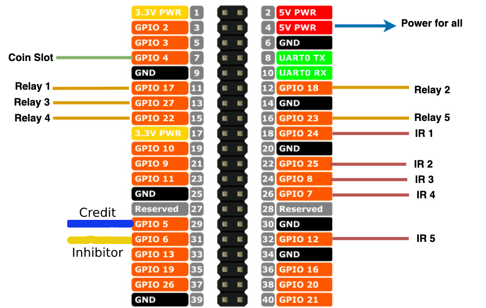

# Money Changer Machine

This is a thesis project request.

## TODO

1. [x] Coin Slot
2. [x] UI/UX Transition
3. [x] Dispensing of bills and coins
4. [x] Denomination Checking
5. [ ] Project Final Testing

# PROJECT DIAGRAM



## PINS ASSIGNMENTS

```
Coin Slot
coin_pin = 4
```

```
Relays 1 to 3 is for bills 100, 50 and 20. While relays 4 and 5 is for coins 5 and 1.
relay_1_pin = 17
relay_2_pin = 18
relay_3_pin = 27
relay_4_pin = 22
relay_5_pin = 23
```

```
IR Sensors 1 to 3 is for bill dispenser 100, 50 and 20. While IR Sensor 4 and 5 is for coins hopper 5 and 1.
ir_sensor_1_pin = 24
ir_sensor_2_pin = 25
ir_sensor_3_pin = 8
ir_sensor_4_pin = 7
ir_sensor_5_pin = 12
```

## License

Money Changer Machine is available under the [MIT license](https://tldrlegal.com/license/mit-license).

## Contact

Copyright (c) 2023 Cavin Pabua
